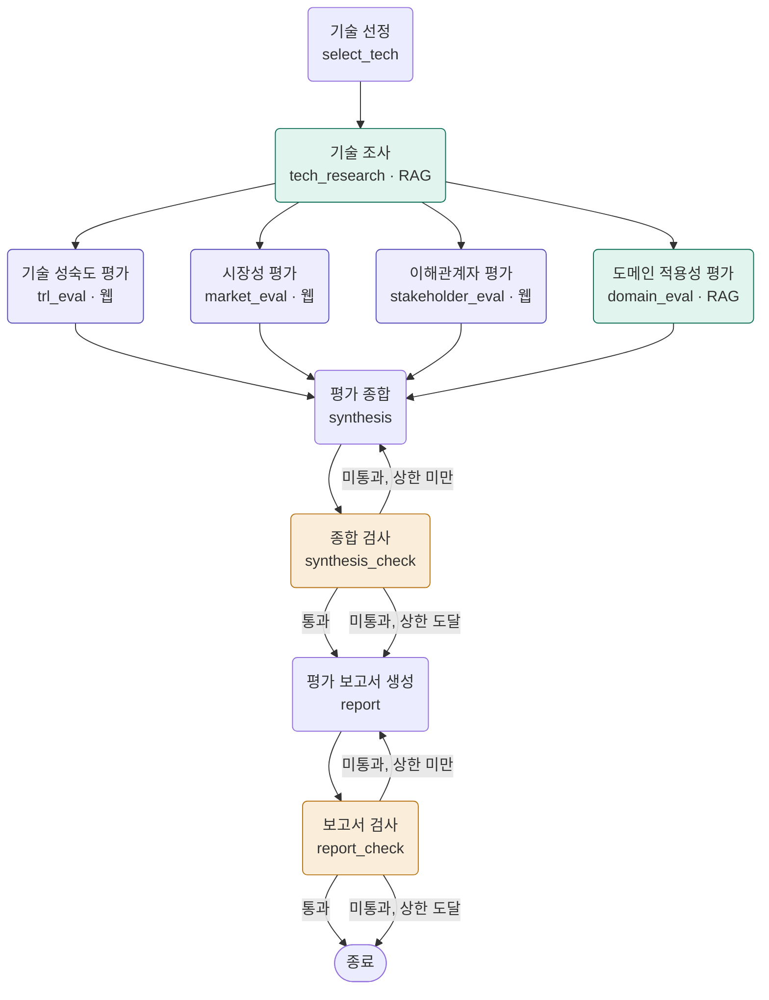
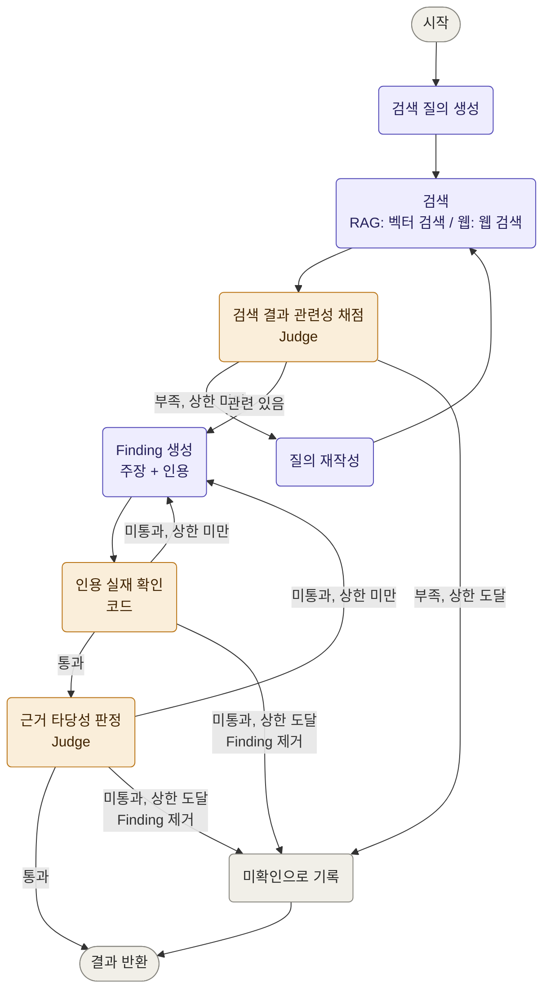

# KV Cache 최적화 기술 다관점 평가

KV 캐시 병목을 상반된 방식으로 푸는 두 기술을 네 관점에서 평가하고, 모든 주장에 검증된 근거를 붙인 보고서를 생성하는 LangGraph 멀티 에이전트 + RAG 파이프라인.

## Quick Start

```bash
git clone git@github.com:Jieun1ee/RAG-pipeline.git && cd RAG-pipeline
python3.11 -m venv .venv && source .venv/bin/activate
pip install -r requirements.txt
cp .env.example .env     # OPENAI_API_KEY, TAVILY_API_KEY, LANGCHAIN_API_KEY 입력
python -m rag.indexer    # 색인 생성 (한 번만)
python app.py            # 전체 실행 → outputs/report.md
```

API 키 없이 흐름만 확인하려면 `python app.py --dry-run`. 옵션 전체는 [Usage](#usage) 참고.

## Requirements

| 항목 | 값 |
|---|---|
| Python | 3.11 |
| API 키 | `OPENAI_API_KEY`, `TAVILY_API_KEY`, `LANGCHAIN_API_KEY` |
| 임베딩 모델 | BAAI/bge-m3. 첫 실행 시 약 2GB 내려받아 로컬에서 돌린다 |
| 색인 생성 | 논문 2편 65쪽 → 청크 187개, 20초 안팎 |
| 전체 실행 | 9분 안팎, 모델 호출 700건 안팎 |

임베딩은 로컬에서 돌아 비용이 들지 않는다. 비용이 발생하는 것은 OpenAI 호출과 Tavily 검색이다.

## Subject

데이터센터 기반 LLM Serving에서 KV 캐시 병목을 상반된 방식으로 푸는 두 기술, **MLA(SW, 데이터를 작게)** 와 **ITME(HW, 담을 공간을 넓게)** 를 기술 성숙도·시장성·이해관계자·도메인 적용성 네 관점에서 평가하는 Multi-Agent + Agentic RAG 프로젝트. 우열을 가리지 않고, 관점에 따라 평가가 어떻게 갈리는지를 근거와 함께 제시한다.

## Overview

- **Objective** : 하나의 기술을 복수 관점에서 중립적으로 비교 평가하고, 모든 주장에 검증된 근거를 붙인 보고서를 생성한다.
- **Method** : Multi-Agent(Distributed) + Agentic RAG. 다섯 에이전트가 같은 서브그래프를 공유하며 검색 도구와 인용 확인 규칙만 다르게 쓴다.
- **Tools** : LangGraph, OpenAI(Generator/Judge 분리), BAAI/bge-m3, FAISS, Tavily, PyMuPDF
- **Domain** : 데이터센터 기반 LLM Serving. 대규모 동시 요청과 비용에 민감한 환경이라 KV 캐시 용량과 처리량의 트레이드오프가 가장 직접적으로 드러난다.

## Selected Technologies

기술 선정은 Human 기반(2안)으로, 과제 Doc Pool에서 진영별 1건씩 직접 골랐다. 두 논문 합계 65쪽으로 200쪽 제한 안이다.

| 진영 | 기술 | 선정 이유 | 원문 |
|---|---|---|---|
| SW | MLA (Multi-head Latent Attention) | KV를 저차원 잠재 공간으로 압축해 캐시를 93.3% 줄이는 어텐션 구조 재설계. 사후 압축과 달리 구조 자체를 바꾸는 접근이고, 공개 모델과 논문으로 구현·수치가 모두 공개되어 근거 확보가 가능하다 | DeepSeek-AI(2024). *DeepSeek-V2*. arXiv, 2405.04434 |
| HW | ITME (Inference Tiered Memory Expansion) | CXL 하이브리드 메모리로 KV 캐시를 GPU 메모리 밖으로 계층 확장. 원본을 줄이지 않고 담을 공간을 넓히는 정반대 접근이며, 메모리 제조사가 제안해 HW 진영을 대표한다 | Jang, H. et al.(2026). *ITME*. arXiv, 2606.12556 |

## Evaluation Criteria

평가 기준은 임의로 만들지 않고 **공개된 표준과 프레임워크의 항목에서 가져왔다.** 기준을 직접 만들면 두 기술 중 하나에 유리한 항목이 섞여도 알아채기 어렵기 때문이다.

| 관점 | 평가 대상 | 근거가 된 프레임워크 | 결과 표현 |
|---|---|---|---|
| 기술 성숙도 | 개발 및 실제 적용 수준 | NASA TRL 정의 (단계별 HW·SW 설명) | TRL 범위 또는 판단 유보 |
| 시장성 | 산업 내 채택 및 확산 가능성 | 미국 에너지부 ARL의 채택 위험 차원 | 차원별 채택 위험 수준 |
| 이해관계자 | 도입으로 영향을 받는 주체 | Rogers 혁신 확산 이론의 혁신 속성 | 주체별 기대 효과와 도입 부담 |
| 도메인 적용성 | LLM Serving 환경에서의 적용 가능성 | ISO/IEC 25010 제품 품질 특성, MLPerf Inference 측정 지표 | 항목별 효과와 제약, 보고 수치 |

### 지표 선정 이유

**기술 성숙도 — NASA TRL.** SWOT처럼 강하다·약하다를 따지는 틀은 상대적이라 두 기술을 나란히 놓는 순간 우열로 읽힌다. TRL은 "지금 몇 단계인가"라는 절대 위치를 준다. NASA 정의가 단계마다 하드웨어 설명과 소프트웨어 설명을 따로 두고 있어, SW 기술인 MLA와 HW 기술인 ITME에 같은 척도를 적용할 수 있다는 점도 컸다. 단, KV 캐시 기술은 논문 발표와 실제 채택 사이에 시차가 있어 모든 판정에 공개 정보 기반 추정임을 명시한다.

**시장성 — 미국 에너지부 ARL.** 시장성을 시장 규모로만 보면 기술 자체의 채택 가능성이 아니라 산업 전체의 전망을 재게 된다. ARL은 채택을 막는 요인을 수요 성숙도, 가치 제안, 자원 성숙도, 운영 허가 같은 차원으로 나눠 둬서, 어디가 장벽인지를 지목할 수 있다. "위험이 높다"가 아니라 "무엇 때문에 높다"가 나온다.

**이해관계자 — Rogers 혁신 확산 이론.** 같은 기술도 주체마다 반응이 다른 이유를 설명하는 틀이다. 기대 효과는 상대적 이점(relative advantage)에, 도입 부담은 호환성(compatibility)과 복잡성(complexity)에 대응한다. 두 축을 분리했기 때문에 **효과도 크고 부담도 큰 상태를 그대로 기록**할 수 있다. 하나로 합치면 이 구간이 사라진다. 도입 주체(STK-1~3)만 두 축으로 보고, 경쟁 진영과 투자 업계 같은 관찰 주체(STK-4~5)는 축을 적용하지 않고 반응을 출처와 함께 기록한다.

**도메인 적용성 — ISO/IEC 25010과 MLPerf Inference.** 적용성 항목을 직접 나열하면 무엇이 빠졌는지 알 수 없다. 국제 표준의 품질 특성에 항목을 대응시키면 커버리지가 보장된다. 메모리 효율은 Resource Utilization, 처리량은 Capacity, 지연은 Time Behaviour, 정확도는 Functional Correctness에 대응한다. 처리량과 지연의 **측정 방식**은 MLPerf Inference를 기준으로 삼는다. 지연 제약을 지키면서 감당하는 최대 처리량을 쓰고, LLM은 TTFT와 TPOT 두 제약을 본다. 그래서 메모리 절감과 처리량은 항상 정확도 변화와 함께 기록한다.

## Features

- **관점별 평가 기준 33개를 데이터로 분리** : 기술 조사(TECH-1~5), 기술 성숙도(TRL-1~9), 시장성(MKT-1~6), 이해관계자(STK-1~5), 도메인 적용성(DOM-1~8). `data/criteria/*.yaml`에 있어 코드를 고치지 않고 기준을 바꿀 수 있다.
- **근거 2단 검증** : 인용이 검색 결과에 실제로 있는지는 코드로 문자열 대조하고, 그 인용이 주장을 뒷받침하는지는 Judge 모델이 판정한다. 둘을 통과하지 못한 서술은 보고서에 들어가지 않는다.
- **짧은 재시도 루프** : 실패는 발생한 단계 안에서 해결한다. 상한에 도달하면 멈추지 않고 "미확인 항목"으로 기록한 뒤 다음 단계로 넘어간다.
- **TRL 구간 규칙 계산** : 단계별 근거 수준(direct/indirect/none)은 모델이 판정하고, 구간은 코드가 규칙으로 계산한다. 직접 근거가 없으면 판단을 유보한다. 모든 TRL 서술에 공개 정보 기반 추정임을 명시한다.
- **확증편향 방지 전략** :
  - *동일 기준 적용* — 두 기술에 같은 기준을 적용하고, 해당하지 않는 기준은 빼지 않고 `not_applicable`과 이유를 기록한다.
  - *상충 의견 보존* — 같은 기준에서 반대 방향으로 나온 서술을 `dissent`로 따로 남겨 종합과 보고서가 볼 수 있게 한다.
  - *균형 검사* — 기술마다 강점과 한계가 모두 나왔는지 확인하고, 한쪽이 비면 미확인 항목으로 적는다.
  - *우열 표현 검사* — 종합과 보고서 단계에서 Judge 모델이 우열·순위·추천 표현을 찾아낸다. 점수를 매기거나 합산하지 않는다.
- **재현성** : 온도 0, 응답 파일 캐시, 설정으로 고정한 재시도 상한. `--dry-run`으로 외부 호출 없이 전체 흐름을 확인할 수 있다.

## Tech Stack

| 구분 | 사용 |
|---|---|
| Framework | LangGraph 1.x (StateGraph, 조건부 엣지, 서브그래프, 병렬 fan-out) |
| LLM/Generator | `gpt-4.1-mini` — 질의 생성, 서술 생성, 수준 판정, 종합, 보고서 작성 |
| LLM/Judge | `gpt-4o-mini` — 검색 관련성, 근거 타당성, 우열 표현 검사. 생성과 다른 계열로 둬 자기 글을 그대로 통과시키지 않게 했다 |
| Retrieval | FAISS(IndexFlatIP) + 자체 sparse 점수, RRF 앙상블 — Hit Rate@5 **0.967**, MRR@5 **0.892** |
| Embedding | BAAI/bge-m3 (오픈소스, MIT) |
| Web Search | Tavily |
| PDF | PyMuPDF |
| Schema | Pydantic v2 (구조화 출력) |

### Embedding 모델 선정

리더보드 순위는 근거로 쓰지 않았다. 범용 벤치마크의 평균이라 이 과제의 문서와 질의 조건을 반영하지 못한다. 대신 네 가지 조건을 기준으로 삼았다.

| 기준 | 이 과제에서의 조건 |
|---|---|
| 언어 | 작업 지시와 결과는 한국어, 문서는 영어 논문. 질의에 한국어가 섞여도 영어 본문을 찾아야 한다 |
| 도메인 용어 | MLA, CXL, HBM, NVMe, TTFT 같은 약어가 많다. 의미 검색만으로는 약어가 정확히 일치하는 본문을 놓친다 |
| 문서 길이 | 논문의 절 단위 청크를 잘리지 않고 한 번에 인코딩할 수 있어야 한다 |
| 실행 비용 | 오픈소스 가중치로 로컬 실행. API 비용이 없고 노트북에서 돌아가는 규모 |

설계 방향이 서로 다른 후보 세 개를 놓고 비교했다.

| 후보 | 유형 | 판단 |
|---|---|---|
| **BAAI/bge-m3** | 다국어 하이브리드 검색형. 1,024차원, 8,192토큰, 100개 이상 언어 | **선정.** 한 번의 인코딩으로 의미 벡터와 토큰 가중치를 함께 출력한다 |
| Qwen/Qwen3-Embedding-0.6B | 지시문 기반 dense 검색형. 32K 토큰 | 언어·길이·규모 조건은 충족하나 dense만 출력한다. 같은 구성을 만들려면 키워드 검색을 따로 붙여야 한다 |
| allenai/SPECTER2 | 과학 논문 특화형. 512토큰, 영어 | 제목·초록으로 유사 논문을 찾도록 학습되어 질문에 맞는 본문 단락을 찾는 용도와 맞지 않는다 |

**bge-m3를 고른 결정적 이유는 도메인 용어 조건이다.** 질의의 약어를 문서의 같은 약어와 직접 맞출 수 있고, 별도의 BM25 색인이나 한국어 형태소 분석기 없이 하이브리드 검색을 구성할 수 있다.

### RAG 파이프라인

RAG는 **기술 조사**와 **도메인 적용성** 두 에이전트에 적용했다. 두 에이전트가 필요로 하는 근거인 동작 방식, 한계, 실험 환경과 보고 수치가 논문 원문에 있기 때문이다. 시장성·이해관계자·기술 성숙도가 다루는 채택 사례, 생태계 동향, 상용 운용 여부는 논문에 실리지 않고 시기에 따라 바뀌므로 웹 검색으로 수집한다.

| 단계 | 처리 | 결과 |
|---|---|---|
| 적재 | PDF에서 본문과 표를 추출하고, 모든 쪽에 반복되는 머리글·바닥글을 걷어낸다 | 문서 |
| 분할 | 페이지 단위로 먼저 나눈 뒤 절 제목이 보이면 그 경계로 조정한다. 문단 경계에서만 자른다 | 청크 |
| 메타데이터 | 청크마다 문서 id, 쪽 번호, 절 제목, 쪽 안 순번을 붙인다 | 메타데이터가 붙은 청크 |
| 색인 | bge-m3로 dense 벡터와 sparse 가중치를 함께 만든다. dense는 정규화해 FAISS에 저장 | 인덱스 |
| 검색 | dense 상위 2k와 sparse 상위 2k를 각각 구해 RRF로 합쳐 상위 k를 돌려준다 | 검색 결과 |

**청킹 전략.** 고정 길이로 자르지 않는다. 문장 중간에서 잘리면 인용문이 두 청크에 걸쳐 원문 대조가 실패하기 때문이다. 페이지 단위에서 출발해 문단 경계에서만 자르고, 절 제목을 만나면 거기서 끊어 새 청크를 시작한다. 절 제목은 이후 청크에 계속 따라붙어 검색 결과만 보고도 문서의 어느 부분인지 알 수 있다. 상한 1,500자를 넘기 전에 문단 경계에서 끊고, 120자 미만 조각은 표·그림 캡션으로 보고 버린다. 논문 2편 65쪽이 187개 청크가 됐다.

**인용 대조용 정규화.** PDF 추출 텍스트에는 줄 끝에서 잘린 단어, 두 칸 공백, 굽은 따옴표가 섞인다. 사람 눈에 같은 문장도 글자로는 다르다. 인용문과 청크 본문 양쪽에 같은 정규화를 걸어야 멀쩡한 인용이 탈락하지 않는다.

### Retrieval 평가

청크 30개를 뽑아 각 청크로만 답할 수 있는 질문을 Generator로 만들고, 그 청크를 정답으로 하는 골든셋을 구성했다. 세 구성을 같은 질문으로 비교했다.

| 구성 | Hit Rate@5 | MRR@5 | 해석 |
|---|---|---|---|
| Dense | 0.967 | 0.872 | 30개 중 29개를 상위 5개 안에서 검색 |
| Sparse | 0.900 | 0.867 | 27개 검색. 상대적으로 누락이 많음 |
| **RRF** | **0.967** | **0.892** | 29개를 검색하면서 정답 순위도 가장 높음 |

RRF는 Dense와 같은 검색 성공률을 유지하면서 정답 청크를 더 높은 순위에 배치했다. 하이브리드 검색의 효과가 확인되어 최종 검색 방식으로 RRF를 채택했다.

## Agents

| 노드 | 역할 | 기준 | 검색 | 결과 |
|---|---|---|---|---|
| `select_tech` | 평가 대상과 기준을 상태에 올린다 | - | - | selected_tech, criteria |
| `tech_research` | 기술별 개요, 메커니즘, 적용 범위, 한계, 보고 수치 | TECH-1~5 | RAG | PerspectiveResult |
| `trl_eval` | 단계별 근거 수준 판정과 TRL 구간 추정 | TRL-1~9 | Web | TRLResult |
| `market_eval` | 채택 위험 수준(ARL 기반)과 근거 | MKT-1~6 | Web | PerspectiveResult |
| `stakeholder_eval` | 주체별 기대 효과와 도입 부담 | STK-1~5 | Web | PerspectiveResult |
| `domain_eval` | 성능·확장성·비용·품질 영향 | DOM-1~8 | RAG | PerspectiveResult |
| `synthesis` / `synthesis_check` | 관점 종합과 검사 | - | - | SynthesisResult, CheckResult |
| `report` / `report_check` | 보고서 생성과 검사 | - | - | final_report, CheckResult |

각 에이전트는 하나의 역할만 맡는다. 관점 에이전트는 서로의 결과를 보지 않고 판단하므로 한 관점의 결론이 다른 관점으로 옮겨 가지 않는다.

## Architecture

### 메인 그래프



기술 조사가 끝나면 네 관점이 병렬로 실행되고, 네 결과가 모두 돌아온 뒤 종합이 시작된다. 초록은 RAG, 보라는 웹 검색, 주황은 검사 노드다.

### 에이전트 내부 서브그래프

다섯 에이전트가 같은 구조를 쓰며 검색 도구와 인용 확인 규칙만 다르다. 기준 × 기술 조합마다 한 번씩 돈다.



### 검증 지점

| 위치 | 코드로 검사 | Judge로 검사 | 상한 도달 시 |
|---|---|---|---|
| 검색 결과 관련성 | - | 결과가 평가 기준과 직접 관련되는가 | 미확인으로 기록하고 반환 |
| 인용 검증 | 인용이 검색 결과 안에 실제로 있는가, 필수 항목이 채워졌는가, TRL에 추정 문구가 있는가 | 인용이 주장을 뒷받침하는가 | 해당 Finding을 제거하고 미확인으로 기록 |
| 종합 검사 | 참조한 근거가 실재하는가, 항목마다 서로 다른 관점 2개 이상인가, 반대 의견이 빠지지 않았는가 | 우열을 판정하는 표현이 있는가 | 미해결 항목을 보고서 6장에 적고 진행 |
| 보고서 검사 | SUMMARY 맨 앞·REFERENCE 맨 뒤, SUMMARY 분량, 본문 인용과 REFERENCE 일치, TRL 문구 | 우열을 판정하는 표현이 있는가 | 미통과 상태를 남기고 종료 |

## Directory

```
.
├── app.py                    실행 진입점. 명령줄 인자를 읽어 그래프나 노드 하나를 돌린다
├── report_pdf.py             마크다운 보고서를 한글 지원 PDF로 변환한다
├── graph.py                  메인 그래프 조립. 노드와 조건부 엣지를 붙여 컴파일한다
├── config.yaml               모델 이름, 재시도 상한, 검색 개수, 실행 범위
├── .env.example              OpenAI·Tavily·LangSmith 환경 변수 예시
├── requirements.txt
│
├── core/                     계약과 로더. 모든 모듈이 공유한다
│   ├── schemas.py            노드 사이를 오가는 값의 형식
│   ├── state.py              전체 그래프와 서브그래프의 상태
│   ├── config.py             설정 로더. 명령줄 인자가 설정값을 덮어쓴다
│   ├── llm.py                생성·판정 모델 호출 창구. 구조화 출력과 캐시
│   ├── cache.py              응답 파일 캐시
│   ├── criteria.py           평가 기준 로더
│   ├── prompts.py            프롬프트 템플릿 로더
│   └── tracing.py            LangSmith 추적 설정과 실행 메타데이터 구성
│
├── agents/                   노드 함수
│   ├── subgraph.py           관점 공용 서브그래프
│   ├── perspective.py        관점 노드 5개, 성숙도 구간 계산
│   ├── synthesis.py          관점 종합
│   ├── report.py             보고서 생성, 참고문헌 조립
│   └── checks.py             인용 실재, 근거 타당성, 종합·보고서 검사
│
├── rag/                      문서 검색
│   ├── loader.py             PDF에서 쪽 단위 텍스트 추출
│   ├── splitter.py           쪽을 청크로 분할
│   ├── textnorm.py           인용 대조용 정규화
│   ├── indexer.py            bge-m3 dense + sparse 색인
│   ├── retriever.py          RRF 앙상블 검색
│   ├── web_search.py         Tavily 웹 검색
│   └── eval.py               Hit Rate@K, MRR 측정
│
├── prompts/                  프롬프트 마크다운 9개
│   └── perspective/          관점별 역할 지시 5개
│
├── data/
│   ├── docs/                 논문 PDF 2편
│   ├── criteria/             평가 기준 YAML 5개
│   ├── fixtures/             단독 실행용 샘플 JSON 8개
│   └── registry.yaml         원문 서지 정보
│
└── outputs/                  report.md, report.pdf, eval_set.json (색인·캐시·로그는 git 제외)
```

코드는 `core/`, `agents/`, `rag/` 세 패키지뿐이고 `prompts/`와 `data/`에는 파이썬 파일이 없다. 평가 기준과 프롬프트를 코드 밖으로 빼 두어 내용 수정과 코드 수정을 분리했다.

## Usage

```bash
python -m venv .venv && source .venv/bin/activate
pip install -r requirements.txt
cp .env.example .env            # OPENAI_API_KEY, TAVILY_API_KEY
python -m core.llm --list       # 접근 가능한 모델 확인 후 config.yaml models 채우기

python -m rag.indexer           # 색인 생성 (한 번만, bge-m3 다운로드 포함)
python app.py --dry-run         # 외부 호출 없이 그래프 전체 통과 확인
python app.py --criteria-limit 1 --retry 1   # 빠른 시험
python app.py                   # 전체 실행 → outputs/report.md
python -m rag.eval              # 검색 평가 (Hit Rate@5, MRR)
```

노드 하나만 돌려 볼 수도 있다. 앞 단계 결과는 `data/fixtures/`에서 채운다.

```bash
python app.py --only market_eval
python -m core.schemas --validate data/fixtures/
```

## Lessons Learned

- **검사 두 개가 서로를 막을 수 있다.** TRL 서술에 "공개 정보 기반 추정" 문구를 넣으라고 했더니, 필수 항목 검사는 통과하지만 근거 타당성 판정이 "인용문에 없는 전제"라며 전부 떨어뜨렸다. 전제를 `claim`에서 `conditions`로 옮겨 해결했다. 검증을 여러 겹 두면 겹끼리 충돌하는지 먼저 확인해야 한다.
- **판정 모델 선택이 실행 시간을 좌우한다.** 판정 호출이 전체의 63%인데 추론 계열 모델은 건당 9.6초, 일반 모델은 0.9초였다. 모델만 바꿔 45분이 9분이 됐다. 다만 근거 통과율이 43%에서 93%로 올라 검증 강도가 달라졌다. 속도와 엄격함은 맞바꾸는 관계다.
- **검색 소스는 기준의 성격을 따라간다.** 처음에는 성숙도를 논문에서, 도메인을 웹에서 찾게 했는데 반대였다. 처리량·지연 수치와 측정 조건은 논문에만 있고, 상용 운용·양산 같은 TRL 상위 단계는 논문에 실리지 않는다.
- **프롬프트의 사소한 군더더기가 비용이 된다.** 파일 첫 줄의 변수 안내 메모가 포맷 대상에 포함되어 검색 결과가 두 번 들어갔다. 렌더된 프롬프트가 1.8배로 부풀었고 66개 작업마다 곱해졌다.
- **인용 대조는 정규화가 전부다.** PDF의 하이픈 줄바꿈과 특수 따옴표를 맞추지 않으면 멀쩡한 인용이 탈락하고 재생성 루프가 계속 돈다.

## Contributors

판교캠퍼스 9반 4조

- **P283 김성현** : State·스키마 설계, 평가 기준 정의, 프롬프트 엔지니어링
- **P292 양지윤** : RAG 파이프라인 구현, 하이브리드 검색, 검색 성능 평가
- **P299 이지은** : 에이전트 구현, 그래프 조립, 근거 검증 로직
